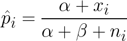
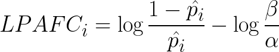
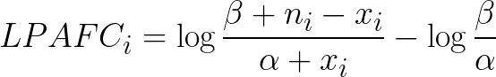
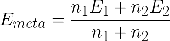

# Details of imbalance analysis of HepG2-FOXA2 ChIP-seq

Here we'll consider studying allelic imbalance in five HepG2-FOXA2 ChIP-seq
datasets.

| Sample | Read Count (non-dup) | Duplication Rate | Peaks | FRiP |
| --- | --- | --- | --- | --- |
| `ENCODE_HepG2_FOXA2_1` | 7,387,781 | 57.81 % | 15,646 | 6.91 % |
| `ENCODE_HepG2_FOXA2_2` | 29,695,447 | 11.79 % | 54,430 | 16.60 % |
| `2018_HepG2_FOXA2_1` | 15,278,836 | 8.13 % | 27,037 | 8.57 % |
| `2018_HepG2_FOXA2_2` | 16,463,009 | 7.15 % | 21,266 | 6.56 % |
| `2018_HepG2_FOXA2_3` | 8,153,199 | 74.97 % | 40,997 | 10.05 % |

## Effect sizes

### Beta-binomial fit

After aligning reads, identifying heterozygous SNPs with QuASAR, and
correcting reference bias with WASP, we fit a beta-binomial distribution to
the data using the method of [Chen et al.](https://www.ncbi.nlm.nih.gov/pmc/articles/PMC4837449/).
That method fits only the "overdispersion" parameter of the beta-binomial
distribution. We extend it to also fit the "mean" parameter. This allows for
a slightly improved fit that can account for a small residual reference bias
that may persist after running WASP.

(While the authors of that paper used an overdispersion/mean parametrization
of the beta distribution, we'll use the α/β shape parametrization from here on.)

The key component of the beta-binomial fit is the beta prior distribution,
illustrated here:

> Histogram of observed ref fraction with estimated beta prior for the 2018
> datasets (combined). The best-fit Beta parameters were α = 4.676, β = 4.324.
> Heterozygous SNPs with 10-fold coverage or greater were used for the fit.
>
> 

> Histogram of observed ref fraction with estimated beta prior for the ENCODE
> datasets (combined). The best-fit Beta parameters were α = 5.063, β = 3.938.
> Heterozygous SNPs with 10-fold coverage or greater were used for the fit.
>
> 

Note that the distribution estimated for the ENCODE datasets is shifted to the
right compared to the estimte for the 2018 datasets. This suggests that the
underlying distributions of the two groups are different (possibly due to 
differences in experimental protocol, sequencing platform, etc.), so we
treat them separately for the next step.

### Bayes estimator of ref allele fraction

This beta distribution provides a prior model for the reference allele fraction
at any given SNP. It will be the basis for a bayesian estimate of the
imbalance effect size.

Specifically, we compute for each SNP a bayes estimator of the "true underlying"
reference allele fraction, using the beta parameters and the observed allele
counts:

Where _x_ and _n_ are, respectively, the reference allele count and total
coverage at the _i_'th SNP. 

### Log fold change

Following ([Mohammadi e al.](https://www.ncbi.nlm.nih.gov/pmc/articles/PMC5668944/),
we convert our estimate of the ref allele fraction to log fold change. We also
add a shift term which accounts for the small residual reference biases we
have observed. The resulting formula is:

or, expanded:

We call this value "log posterior allelic fold change", since it is based
on a bayesian posterior estimate of the ref allele fraction. 

Once these effect sizes are computed, we can check on how they are distributed
in the 2018 and ENCODE data. Note that in both cases the effects are centered
on zero, thanks to the shift term.

> Histogram of estimated effect sizes in 2018 data (SNPs with > 10-fold coverage)
>
> x-axis: effect size (LPAFC), y-axis: number of SNPs
>
> 

> Histogram of estimated effect sizes in ENCODE data (SNPs with > 10-fold coverage)
>
> x-axis: effect size (LPAFC), y-axis: number of SNPs
>
> 

### Meta-analysis

Where we have computed an effect size for a variant in both the 2018 and ENCODE
datasets, we can meta-analyze them using the two coverage levels, according to:

Where _E1_ and _E2_ are the two effect sizes, and _n1_ and _n2_ the two
coverage levels.

> Histogram of estimated effect sizes after meta-analysis
>
> x-axis: effect size (LPAFC), y-axis: number of SNPs
>
> 